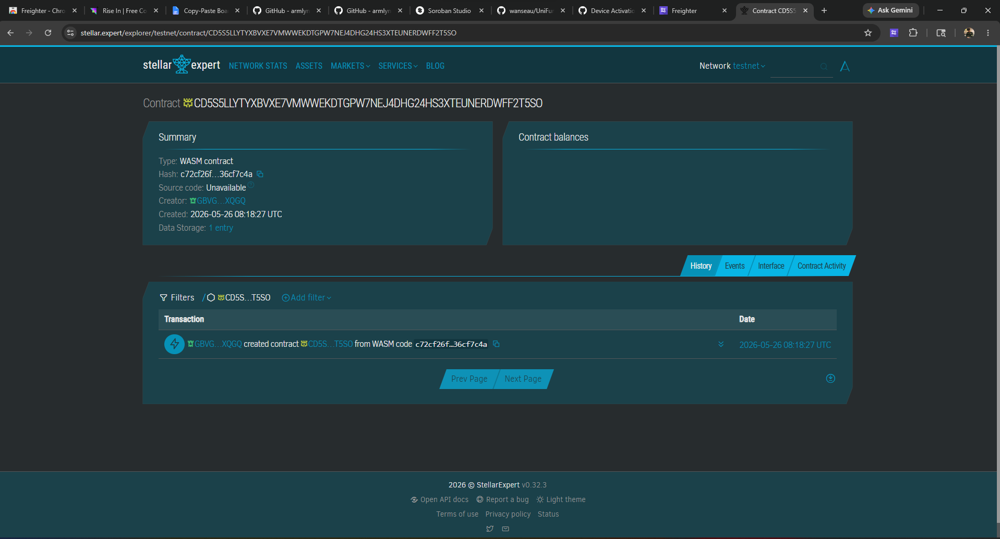

# UniFund DAO

A decentralized treasury system tailored for university student organizations, built with Rust and the Stellar Soroban smart contract platform.

*Created for the Stellar Philippines Bootcamp 2026.*

---

## 📖 Overview

UniFund DAO empowers university student clubs to manage their club funds transparently on the blockchain. Any student with a membership token can propose a budget for an event or equipment purchase, and the rest of the club can vote on it. To ensure safe oversight, a Faculty Advisor acts as the admin with veto power.

### Narrative Mapping

To map standard DAO terminology to our university use-case:
- **Admin** = *Faculty Advisor* (Has veto power over any proposal before it's executed).
- **Governance Token** = *Student Club Membership Token* (1 token = 1 vote weight).
- **Treasury Token** = *Club Funds* (e.g., USDC or XLM).
- **Proposals** = *Event Budgets* or *Equipment Purchases*.

---

## ⚙️ How It Works (The Lifecycle)

1. **Deposit:** Students, alumni, or donors deposit Club Funds into the treasury.
2. **Propose:** Any student holding a Membership Token can submit a proposal requesting funds for an event or purchase.
3. **Vote:** Students vote `For`, `Against`, or `Abstain`. Voting power is determined by their Membership Token balance.
4. **Queue:** If the proposal reaches the required quorum (approval rating) and the voting window has closed, the proposal is queued. The requested funds are immediately reserved from the treasury pool.
5. **Veto Period:** Once queued, a mandatory delay (veto period) begins. During this time, the Faculty Advisor can review the proposal. If they deem it inappropriate, they can cancel (veto) it, returning the reserved funds to the treasury.
6. **Execute:** If the veto period expires without cancellation, the proposal can be executed, and the funds are automatically transferred to the recipient.

---

## 📂 Project Structure

This project is lean and contains exactly what you need to deploy the contract:

- `Cargo.toml` - Project configuration, dependencies (Soroban SDK), and build optimization profiles.
- `src/lib.rs` - The complete on-chain Rust smart contract logic.
- `src/test.rs` - Robust unit tests simulating the happy path, vetoes, and failed quorums.

---

## 🚀 Running in Soroban Studio

To run and test this code without installing any local build tools:

1. Open [Soroban Studio](https://soroban.stellar.org/studio) in your browser.
2. Create a new empty project.
3. Replace the auto-generated `Cargo.toml` with the contents of the `Cargo.toml` in this repo.
4. Replace `src/lib.rs` and `src/test.rs` with the respective files in this repo.
5. Click **Build** and **Deploy** right from your browser!

---

## 💻 Local CLI Usage (Optional)

If you have the Microsoft C++ Build Tools and the Rust toolchain installed, you can build and deploy via the CLI:

```bash
# 1. Build the contract
cargo build --target wasm32-unknown-unknown --release

# 2. Optimize the binary
soroban contract optimize --wasm target/wasm32-unknown-unknown/release/unifund_dao.wasm

# 3. Deploy to Testnet
soroban contract deploy \
  --wasm target/wasm32-unknown-unknown/release/unifund_dao.wasm \
  --source admin \
  --network testnet
```
Contract ID: CD5S5LLYTYXBVXE7VMWWEKDTGPW7NEJ4DHG24HS3XTEUNERDWFF2T5SO
Link: https://stellar.expert/explorer/testnet/contract/CD5S5LLYTYXBVXE7VMWWEKDTGPW7NEJ4DHG24HS3XTEUNERDWFF2T5SO
